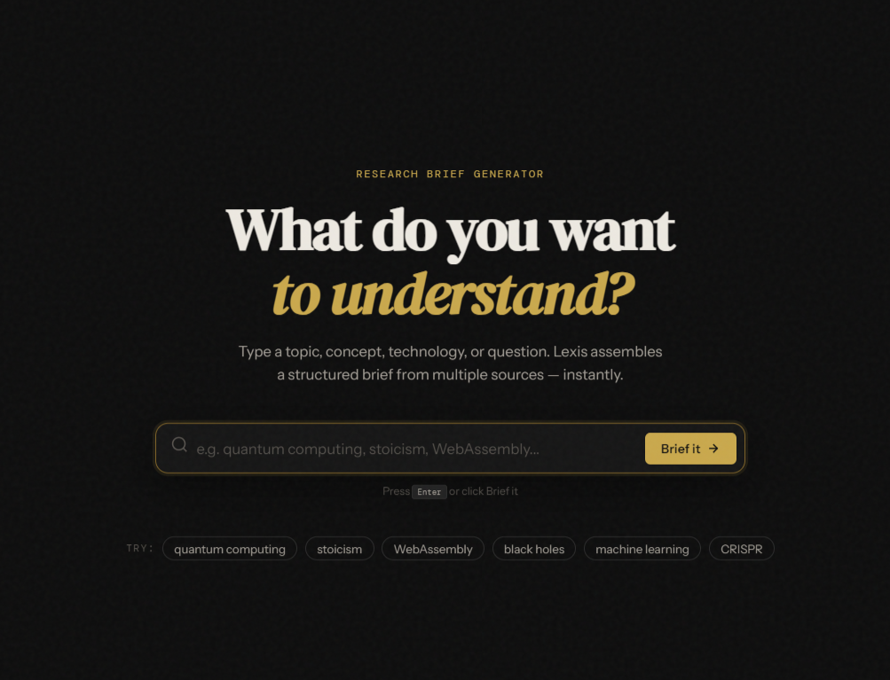

# Lexis — Research Briefs, Instantly

> Type any topic. Get a structured, beautiful research brief from multiple sources in seconds.



## What it does

Lexis solves information overload. Instead of opening 10 tabs and losing track, you type a topic and get a single, structured brief assembled from:

| Source | What it provides |
|---|---|
| **Wikipedia** | Definition and summary |
| **Open Library** | Books worth reading on the topic |
| **DEV.to** | Practitioner articles and tutorials |
| **arXiv** | Academic papers at the research frontier |
| **Quotable** | A relevant quote to anchor the brief |

All fetched in parallel. All no-auth, no API key required.

## Why it's different

Most aggregators stack results. Lexis imposes editorial structure — every brief follows the same five-section format (definition → perspective → deep reading → practitioner view → research frontier). That structure is the product.

## Tech

- Vanilla JS (ES modules) — no framework needed for this
- Vite for dev/build
- All external APIs are free and require no authentication
- History stored in `localStorage` — no backend, no accounts

## Run locally

```bash
npm install
npm run dev
```

Open `http://localhost:5173`

## Deploy

```bash
npm run build
```

Deploy the `dist/` folder to GitHub Pages, Vercel, Netlify, or any static host.

### GitHub Pages (quick deploy)

1. Build: `npm run build`
2. Push `dist/` to a `gh-pages` branch, or use the [vite-plugin-gh-pages](https://github.com/craftzdog/vite-plugin-gh-pages) plugin.

## Project structure

```
lexis-brief/
├── index.html
├── vite.config.js
├── package.json
├── public/
│   └── favicon.svg
└── src/
    ├── main.js           # App controller, view transitions, events
    ├── style.css         # All styles — tokens, components, animations
    ├── api/
    │   └── index.js      # All API fetchers + parallel orchestrator
    ├── components/
    │   └── brief.js      # Pure render function for brief view
    └── utils/
        └── history.js    # localStorage history management
```

## Roadmap

- [ ] Export brief as PDF
- [ ] Share brief via URL (encode topic in query string)
- [ ] News section via GNews API
- [ ] Dark/light theme toggle
- [ ] Keyboard shortcut reference modal

## License

MIT
